# Open Lovable: The Coordination Layer for AI-Native Software

## Table of Contents

- [Part 1: Foundations](#part-1-foundations)
- [Chapter 1: Architecture Overview - The System as Conversation](#chapter-1-architecture-overview---the-system-as-conversation)
- [Chapter 2: Processing Natural Intent - The Intent Analyzer](#chapter-2-processing-natural-intent---the-intent-analyzer)
- [Chapter 3: Content Extraction at Scale - Firecrawl Integration](#chapter-3-content-extraction-at-scale---firecrawl-integration)
- [Chapter 4: The Provider Abstraction - Pluggable LLMs Without Coupling](#chapter-4-the-provider-abstraction---pluggable-llms-without-coupling)
- [Part 2: The Generation Loop](#part-2-the-generation-loop)
- [Chapter 5: Streaming Code Generation - Perceived Performance as Architecture](#chapter-5-streaming-code-generation---perceived-performance-as-architecture)
- [Chapter 6: Context Selection - The Art of Smart File Inclusion](#chapter-6-context-selection---the-art-of-smart-file-inclusion)
- [Chapter 7: Response Parsing - Extracting Files, Packages, and Actions from AI Output](#chapter-7-response-parsing---extracting-files-packages-and-actions-from-ai-output)
- [Chapter 8: Structured Prompting - Guiding the LLM to Produce Usable Artifacts](#chapter-8-structured-prompting---guiding-the-llm-to-produce-usable-artifacts)
- [Part 3: Application and Validation](#part-3-application-and-validation)
- [Chapter 9: The Sandbox Abstraction - Execution as a Swappable Capability](#chapter-9-the-sandbox-abstraction---execution-as-a-swappable-capability)
- [Chapter 10: Vite as the Inner Loop - Fast Feedback Under Uncertainty](#chapter-10-vite-as-the-inner-loop---fast-feedback-under-uncertainty)
- [Chapter 11: Surgical Code Application - Precision Over Rewrite](#chapter-11-surgical-code-application---precision-over-rewrite)
- [Chapter 12: Build Validation and Error Recovery - Closing the Loop](#chapter-12-build-validation-and-error-recovery---closing-the-loop)
- [Part 4: State and Continuity](#part-4-state-and-continuity)
- [Chapter 13: Conversation State Architecture - Memory as Product Behavior](#chapter-13-conversation-state-architecture---memory-as-product-behavior)
- [Chapter 14: Project Memory - File Manifests and Structural Context](#chapter-14-project-memory---file-manifests-and-structural-context)
- [Chapter 15: Preference Learning - Adaptive Editing Styles](#chapter-15-preference-learning---adaptive-editing-styles)
- [Part 5: UI and Experience](#part-5-ui-and-experience)
- [Chapter 16: Real-Time Sandbox Preview - Making Generation Tangible](#chapter-16-real-time-sandbox-preview---making-generation-tangible)
- [Chapter 17: Error Communication - From Stack Traces to Decisions](#chapter-17-error-communication---from-stack-traces-to-decisions)
- [Chapter 18: Motion and Micro-Feedback - UX for Waiting States](#chapter-18-motion-and-micro-feedback---ux-for-waiting-states)
- [Part 6: Robustness and Operations](#part-6-robustness-and-operations)
- [Chapter 19: Package Installation Strategy - Dependency Chaos Management](#chapter-19-package-installation-strategy---dependency-chaos-management)
- [Chapter 20: Timeout and Deadline Management - Latency as a Resource](#chapter-20-timeout-and-deadline-management---latency-as-a-resource)
- [Chapter 21: Fallback Patterns - Designing for Provider Failure](#chapter-21-fallback-patterns---designing-for-provider-failure)
- [Part 7: Synthesis and Transfer](#part-7-synthesis-and-transfer)
- [Chapter 22: Transferable Patterns - What to Steal, What to Avoid](#chapter-22-transferable-patterns---what-to-steal-what-to-avoid)
- [Chapter 23: Building Your Own - A Decision Framework](#chapter-23-building-your-own---a-decision-framework)
- [Epilogue: The Architectural Bet Revisited](#epilogue-the-architectural-bet-revisited)

---

## Part 1: Foundations
*Systems like this do not fail because the model is weak. They fail because the handoff between intent, generation, and execution is weak.*

[Back to Table of Contents](#table-of-contents)

---

## Chapter 1: Architecture Overview - The System as Conversation

### Opening
Traditional web applications optimize a request path. AI-native code systems optimize a conversation path. That sounds subtle, but it changes everything: state, interfaces, reliability boundaries, and the definition of correctness.

Open Lovable exists to solve a compound problem: accept fuzzy human intent, convert it into code, execute that code in an isolated environment, and feed the result back into the next round of intent. If any transition is weak, trust collapses. A state-of-the-art generator with weak execution feedback still fails users in practice.

By the end of this chapter, you will see the architectural bet clearly: this system is not primarily a generator. It is a coordinator. Every subsystem serves that coordination loop.

### Body
At a high level, Open Lovable runs three major flows in parallel conceptually, even when implementation is sequential in places:

- Reference flow: extract external context from websites and user-provided assets.
- Generation flow: transform user intent plus context into structured code artifacts.
- Application flow: apply code into a live sandbox, validate, then preview.

The key design choice is to treat user interaction as a persistent thread rather than isolated requests. The system stores message history, edit outcomes, and preference hints to improve subsequent cycles.


The loop closes through memory. That is the architectural center of gravity.

A second foundational decision is interchangeability at infrastructure seams. The same logical commands must run regardless of which sandbox backend is active. The same model invocation surface must work regardless of which provider actually serves tokens.

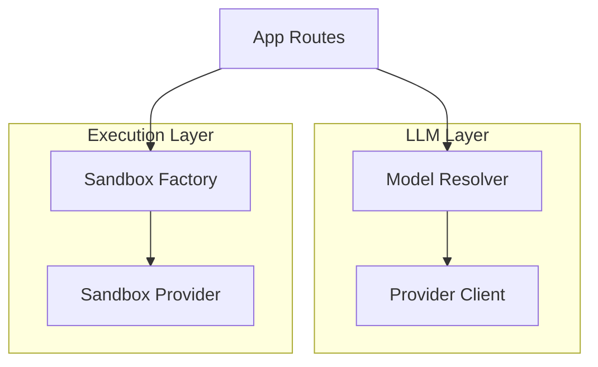

This is not just cleanliness. It is risk management. Vendor outages, quota limits, and policy changes are operational certainty in AI systems.

To make this concrete, the following pseudocode shows the orchestration shape. It is simplified, but it captures the control-plane mindset.

```ts
// Pseudocode - illustrates orchestration structure
function handleRequest(userInput, priorContext) {
  intent = inferIntent(userInput, priorContext)
  files = chooseRelevantFiles(intent, priorContext.manifest)

  stream = generateCodeStream({ userInput, files, priorContext })
  parsed = parseStructuredOutput(stream)

  applyResult = applyChanges(parsed, sandboxSession)
  runtimeState = validateAndRefreshPreview(sandboxSession)

  return persistConversationStep({ intent, parsed, applyResult, runtimeState })
}
```

The architectural insight is simple and easy to underestimate: each stage emits both output and diagnosis data. This turns a brittle pipeline into an adaptive loop.

#### Deep Dive: Why Global Process State Is Acceptable Here
In many systems, process-level mutable state is a code smell. Here, it is a deliberate compromise. The runtime pattern is effectively session-scoped interaction where a single active development loop owns the mutable sandbox and conversation context.

When concurrency requirements are low and interactive latency matters, global in-memory session objects can reduce incidental complexity dramatically. You avoid premature distributed state machinery while retaining the ability to graduate later.

The risk is obvious: accidental cross-session leakage in multi-tenant deployment. The mitigation is equally obvious: once concurrency increases, move state ownership to explicit session containers keyed by authenticated identity and isolate execution workers.

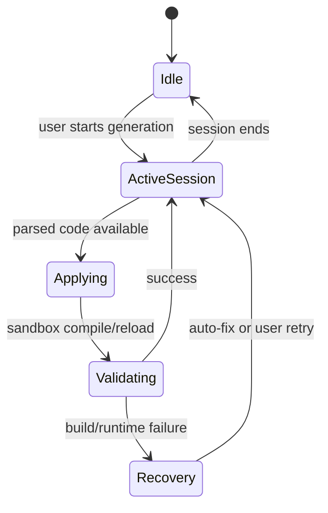

### Apply This
1. Pattern: Conversation-Centric State
Problem it solves: Stateless generation cannot improve with user history.
How to adapt: Store request, response, edit result, and runtime outcome for each turn.
Pitfall: Do not let history grow unbounded; enforce a sliding window.

2. Pattern: Boundary Abstractions
Problem it solves: Vendor lock-in at model and execution layers.
How to adapt: Introduce one resolver for model providers and one factory for runtime providers.
Pitfall: Avoid leaky interfaces that expose provider-specific details.

3. Pattern: Feedback as First-Class Output
Problem it solves: Systems that generate code but cannot explain failures.
How to adapt: Require each stage to emit telemetry and error context.
Pitfall: Logging without classification quickly becomes noise.

4. Pattern: Isolation as Product Feature
Problem it solves: Unsafe direct execution on host environments.
How to adapt: Treat sandboxes as mandatory for user-generated execution.
Pitfall: Over-rotating on isolation without lifecycle cleanup creates cost leaks.

5. Pattern: Control Plane Before Capability Plane
Problem it solves: Shipping features before coordination maturity.
How to adapt: Build orchestration primitives before adding many model/tool features.
Pitfall: Teams often invert this and pay later through reliability debt.

---

## Chapter 2: Processing Natural Intent - The Intent Analyzer

### Opening
In Chapter 1, we framed Open Lovable as a coordinator. The first hard coordination problem is intent compression: users express goals in natural language, but the system must choose concrete files and edit strategies.

Most teams overcomplicate this early by treating intent as a pure classification problem for another model. Open Lovable does something more pragmatic: deterministic heuristics first, probabilistic judgment second. That ordering matters because file selection errors are multiplicative. Wrong files in context produce wrong code, even when generation quality is high.

By the end of this chapter, you will understand why regex-driven pattern registries are not a hack here. They are the right abstraction for bounded, high-frequency intent routing.

### Body
The analyzer maps prompts into a finite edit taxonomy. The categories are intentionally operational, not semantic. That is the right framing because the output consumer is the execution pipeline, not a reporting dashboard.

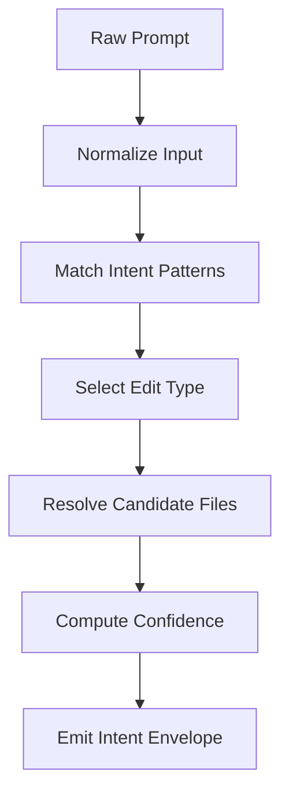

A representative taxonomy looks like this:

- Update existing component
- Add feature surface
- Fix issue
- Update style/theme
- Refactor structure
- Full rebuild
- Add dependency

This taxonomy is useful because it aligns directly with downstream behavior. For example, full rebuild path chooses minimal prior context and broad overwrite permission, while targeted update path emphasizes local component neighborhoods.

The following pseudocode illustrates intent routing as data, not sprawling conditional logic.

```ts
// Pseudocode - pattern registry architecture
patterns = [
  { type: "UPDATE_COMPONENT", rules: ["update", "change", "modify"], resolver: resolveComponentFiles },
  { type: "ADD_FEATURE", rules: ["add", "create", "implement"], resolver: resolveInsertionPoints },
  { type: "FIX_ISSUE", rules: ["fix", "error", "debug"], resolver: resolveErrorHotspots },
  { type: "FULL_REBUILD", rules: ["from scratch", "rebuild"], resolver: resolveEntryPoint }
]

function inferIntent(prompt, manifest) {
  match = findFirstPattern(prompt, patterns)
  if (!match) return fallbackIntent(manifest.entry)

  targets = match.resolver(prompt, manifest)
  score = confidence(prompt, match.type, targets)
  return { type: match.type, targets, score }
}
```

Two implementation decisions stand out.

First, confidence is not used as vanity metadata. It is a control signal for context width and fallback behavior. Low confidence can intentionally push the system toward safer, broader edits or clarification requests.

Second, file resolvers leverage project memory structures rather than raw filename matching. Prompt terms are matched against component names, import relationships, and known UI landmarks.

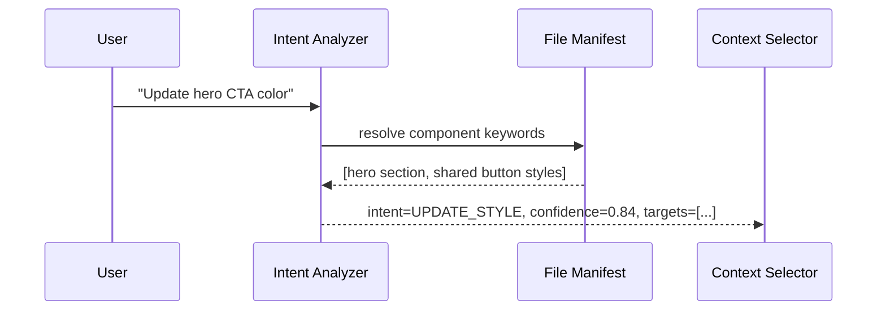

This is where many systems underinvest. They treat intent and context as separate concerns, then wonder why model output is unstable.

#### Deep Dive: Why 80 Percent Pattern Coverage Is Strategically Enough
A heuristic analyzer does not need perfect language understanding. It needs high precision on frequent actions and safe fallback for rare ambiguity.

If your top request shapes are captured, the system feels intelligent most of the time. For the long tail, the design objective is graceful degradation, not perfect interpretation. Open Lovable gets leverage by combining deterministic classification with conversational continuity. Future turns can repair misclassification cheaply.

A common anti-pattern is chasing semantic completeness too early. That increases complexity while reducing observability, because LLM-based classification can be harder to debug than deterministic patterns.

### Apply This
1. Pattern: Operational Taxonomy
Problem it solves: Free-form intent labels that do not map to action.
How to adapt: Define intent categories by downstream execution behavior.
Pitfall: Taxonomies become noisy when categories overlap heavily.

2. Pattern: Pattern Registry
Problem it solves: Intent logic trapped in nested conditionals.
How to adapt: Encode patterns, rules, and resolvers as structured data.
Pitfall: If precedence is unclear, the registry becomes nondeterministic.

3. Pattern: Confidence as Routing Signal
Problem it solves: Same pipeline behavior for high-certainty and low-certainty requests.
How to adapt: Tie confidence thresholds to context breadth and fallback strategy.
Pitfall: Do not expose raw confidence as user truth; treat it as internal control.

4. Pattern: Resolver over Filename Search
Problem it solves: Keyword match picks semantically wrong files.
How to adapt: Resolve targets through manifest metadata and component relationships.
Pitfall: Stale manifests silently degrade resolver quality.

5. Pattern: Safe Fallbacks
Problem it solves: Analyzer failures causing brittle generation.
How to adapt: Define default intent and target policy when no pattern matches.
Pitfall: Fallback that is too broad can create unintended large rewrites.

---

## Chapter 3: Content Extraction at Scale - Firecrawl Integration

### Opening
Chapter 2 established how internal intent is formed. This chapter addresses external grounding: when users ask for something inspired by an existing site, the system must convert a live website into machine-usable design and content signals.

Raw HTML is rarely enough. Dynamic rendering, deferred assets, and noisy markup reduce direct usefulness for generation. Open Lovable uses a scraping abstraction that returns normalized payloads in multiple representations so downstream stages can reason at different levels.

By the end of this chapter, you will understand why robust extraction is less about crawling and more about producing the right intermediate representations for a generation pipeline.

### Body
The extraction layer is built around a small contract: accept URL and extraction options, return structured response including content and metadata, and degrade gracefully when external dependencies are unavailable.

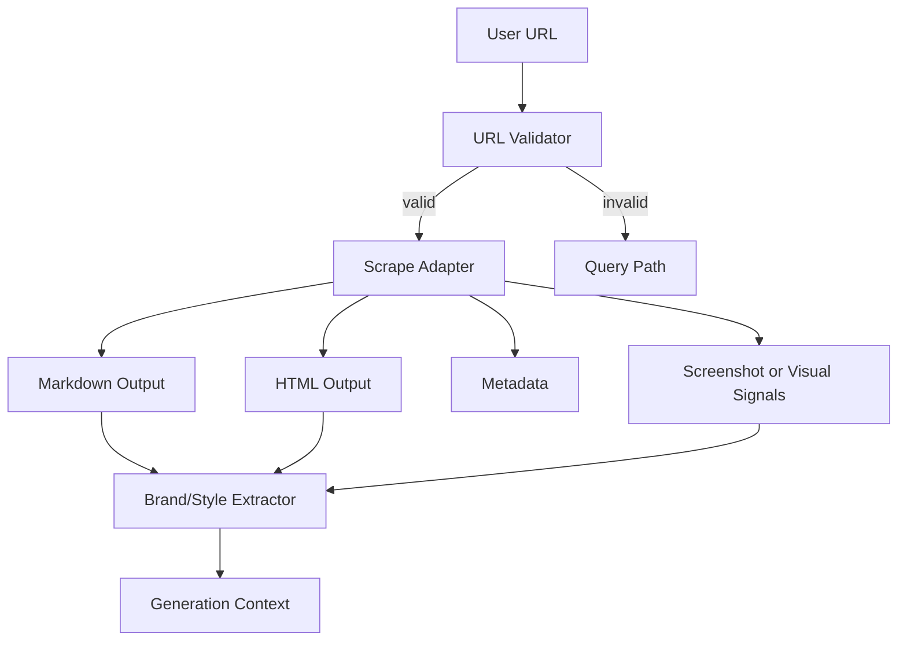

A key design insight is dual-format extraction. Markdown captures semantic content cleanly. HTML preserves structural detail useful for layout inference and component decomposition. Combining both improves model grounding with lower prompt ambiguity.

```ts
// Pseudocode - extraction contract
function extractReference(url, options) {
  if (!isValidUrl(url)) return { mode: "query" }

  result = scrapeProvider.fetch(url, {
    outputModes: ["semantic-markup", "layout-markup"],
    timeoutMs: options.timeout,
    waitForMs: options.waitFor
  })

  if (!result.ok) return fallbackReference(url)

  return {
    markdown: result.markdown,
    html: result.html,
    metadata: result.meta,
    visual: result.screenshot
  }
}
```

The fallback path is not a courtesy, it is architecture. Development workflows and degraded provider conditions must not halt the entire system. Returning mock or partial payloads lets the rest of the pipeline continue and preserves user momentum.

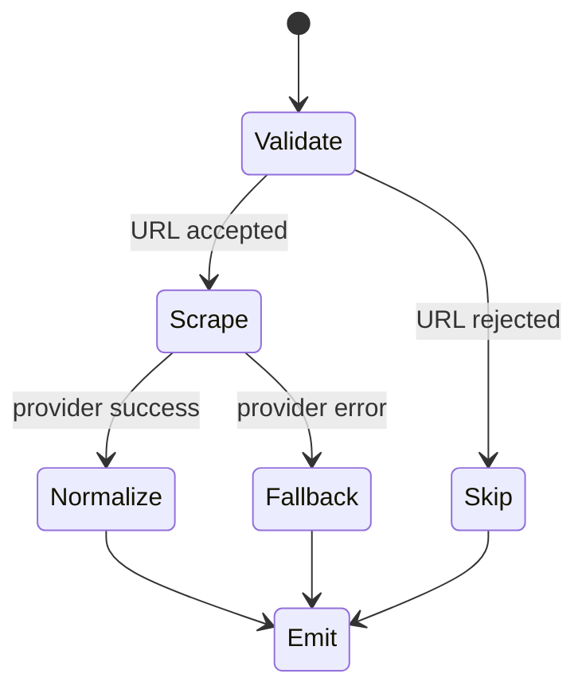

Another underappreciated detail is option tuning. Wait and timeout parameters are policy levers. Too low and you lose dynamic content. Too high and request latency undermines interaction quality. Good defaults beat configurable chaos.

#### Deep Dive: Extraction Is an Inference Problem, Not a Fetch Problem
Teams often frame scraping as transport. In practice, it is feature engineering for downstream AI.

The useful question is not, "Did we fetch the page?" It is, "Did we emit a context package that minimizes generation ambiguity?"

That shift leads to design-token extraction, section-level decomposition, and screenshot-assisted style inference. Even simple color and spacing hints from visual captures can stabilize generated output when textual description is underspecified.

### Apply This
1. Pattern: Multi-Representation Extraction
Problem it solves: Single-format payloads that lose key signals.
How to adapt: Emit semantic, structural, and visual forms from one fetch pass.
Pitfall: Overloading prompts with raw data; summarize before injection.

2. Pattern: Adapter Boundary
Problem it solves: Direct coupling to external SDK shape.
How to adapt: Wrap provider SDK in your own stable response contract.
Pitfall: Thin wrappers that still leak provider-specific fields everywhere.

3. Pattern: Graceful Degradation
Problem it solves: End-to-end failure when extraction provider is down.
How to adapt: Return fallback payloads that preserve pipeline continuity.
Pitfall: Fallback responses must be clearly marked to avoid silent quality drift.

4. Pattern: Policy Defaults
Problem it solves: Latency instability from ad hoc request tuning.
How to adapt: Set strong defaults for wait and timeout; expose limited overrides.
Pitfall: Too many knobs destroy predictability.

5. Pattern: Extraction for Generation
Problem it solves: Treating crawl output as final user artifact.
How to adapt: Optimize extracted payload for downstream model reasoning.
Pitfall: Avoid shipping massive unfiltered HTML into generation contexts.

---

## Chapter 4: The Provider Abstraction - Pluggable LLMs Without Coupling

### Opening
In Chapter 3, we treated web extraction as an abstract capability behind a stable interface. The same principle now appears at the model layer, where vendor volatility is even higher.

Open Lovable supports multiple model ecosystems through a resolver that maps requested model identity to a provider client and an effective model target. This is more than convenience. It is the system's hedge against changing model quality, pricing, and availability.

By the end of this chapter, you will be able to design a provider abstraction that supports explicit overrides, convention-based routing, gateway paths, and cache-efficient client reuse.

### Body
The core mechanism is model resolution rather than hard registration. A requested model identifier carries enough information to derive provider in most cases, while still allowing explicit configuration overrides.

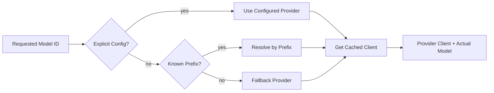

Resolution policy usually follows this precedence:

1. Explicit model configuration with provider and endpoint overrides.
2. Convention mapping by model namespace prefix.
3. Special-case mappings for nonstandard routes.
4. Stable fallback for unknown or unsupported identifiers.

This keeps new model adoption cheap. In many cases, adding a model means configuration changes, not code branches.

```ts
// Pseudocode - model resolution and client reuse
function resolveModel(requestedModel) {
  cfg = lookupModelConfig(requestedModel)
  if (cfg) return { provider: cfg.provider, model: cfg.actualModel, endpoint: cfg.baseUrl }

  if (requestedModel.startsWith("openai/")) return { provider: "openai", model: requestedModel }
  if (requestedModel.startsWith("anthropic/")) return { provider: "anthropic", model: requestedModel }
  if (requestedModel.startsWith("google/")) return { provider: "google", model: requestedModel }

  return { provider: "fallback", model: defaultModel() }
}

function getClient(provider, credentials, endpoint) {
  key = stableKey(provider, credentials, endpoint)
  if (cache.has(key)) return cache.get(key)

  client = constructProviderClient(provider, credentials, endpoint)
  cache.set(key, client)
  return client
}
```

Client caching matters because provider client creation can involve network checks, auth setup, and runtime initialization. Recreating clients per request introduces avoidable latency and failure points.

A second layer is gateway support. When present, gateway credentials can route multiple providers through a unified endpoint. This simplifies secret management and centralizes policy without rewriting business logic.

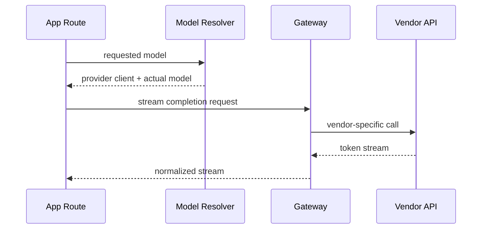

#### Deep Dive: Avoiding Leaky Abstractions in Multi-Provider Systems
A bad abstraction pretends providers are identical. A good abstraction normalizes what should be common and surfaces what must remain variable.

Common plane:

- Message payload shape
- Streaming interface
- Error envelope classification

Variable plane:

- Base URL conventions
- Auth semantics
- Provider-specific model naming quirks

When teams hide all variance, debugging becomes impossible. When they expose all variance, abstraction is pointless. The craft is choosing the seam.

### Apply This
1. Pattern: Resolution Pipeline
Problem it solves: Manual provider wiring for each new model.
How to adapt: Resolve provider by layered policy: explicit config, naming convention, fallback.
Pitfall: Precedence bugs can quietly route traffic to wrong providers.

2. Pattern: Stable Client Cache
Problem it solves: Repeated client initialization cost and flakiness.
How to adapt: Cache clients by provider plus credential and endpoint identity.
Pitfall: Cache keys that ignore endpoint variants lead to subtle cross-talk.

3. Pattern: Gateway-Compatible Design
Problem it solves: Secret sprawl and per-provider operational divergence.
How to adapt: Add optional gateway mode that preserves same app-facing interface.
Pitfall: Gateway outages become shared failure domain; keep direct path ready.

4. Pattern: Explicit Fallback Model
Problem it solves: Unknown model IDs causing hard request failures.
How to adapt: Define a default provider-model pair with predictable behavior.
Pitfall: Silent fallback can mask integration errors; emit trace metadata.

5. Pattern: Normalize, Then Expose Differences
Problem it solves: Either over-generalized or over-specialized provider layers.
How to adapt: Normalize core invocation interface, keep provider quirks at boundaries.
Pitfall: Do not leak vendor quirks into route-level business logic.

---

## End of Part 1

Part 1 established the system's architectural thesis: quality comes from the coordination layer, not from any single model or runtime. Part 2 turns that thesis into the core execution loop: streaming generation, context budgeting, response parsing, and prompt discipline.

---

## Part 2: The Generation Loop
*The system earns trust when partial results arrive early, structure survives model variability, and context is chosen with intent.*

[Back to Table of Contents](#table-of-contents)

---

## Chapter 5: Streaming Code Generation - Perceived Performance as Architecture

### Opening
Part 1 explained why this system is a coordinator. The core loop now begins with the most visible coordination decision: stream everything that can be streamed.

Most teams treat streaming as a UI flourish. In code-generation systems, it is architecture. A response that takes time but shows steady progress feels reliable. A response that is silent until completion feels broken, even if total latency is similar.

By the end of this chapter, you will understand streaming as a control-plane primitive that influences error handling, user trust, and downstream parsing behavior.

### Body
The generation path assembles a request envelope from three sources:

- System constraints: output format, style boundaries, safety constraints
- Selected project context: files likely relevant to the requested change
- User turn intent: explicit request plus conversation-local hints

Then it invokes a streaming interface and emits partial output to the client while simultaneously accumulating parse-ready text server-side.

```mermaid
sequenceDiagram
    participant UI as Client UI
    participant API as Generation Route
    participant RES as Model Resolver
    participant LLM as Provider Stream
    participant PAR as Parser Buffer

    UI->>API: generate request
    API->>RES: resolve provider/model
    RES-->>API: client + actual model
    API->>LLM: start stream
    LLM-->>API: token chunk
    API-->>UI: token chunk
    API->>PAR: append chunk
    LLM-->>API: final chunk
    API->>PAR: finalize structured text
```

The dual-path flow is critical. Tokens are not only for user display. They are the material for structured extraction after completion. That means streaming logic must preserve deterministic ordering and robust buffering.

```ts
// Pseudocode - streaming orchestration
function streamGeneration(envelope) {
  stream = modelClient.streamText(envelope)
  buffer = ""

  for (chunk in stream) {
    emitToClient(chunk.text)
    buffer += chunk.text
  }

  parsed = parseStructuredOutput(buffer)
  return { rawText: buffer, parsed }
}
```

Streaming also changes failure semantics. You can fail after partial output has already been rendered. The right behavior is not binary success or failure; it is partial completion with intelligible recovery.

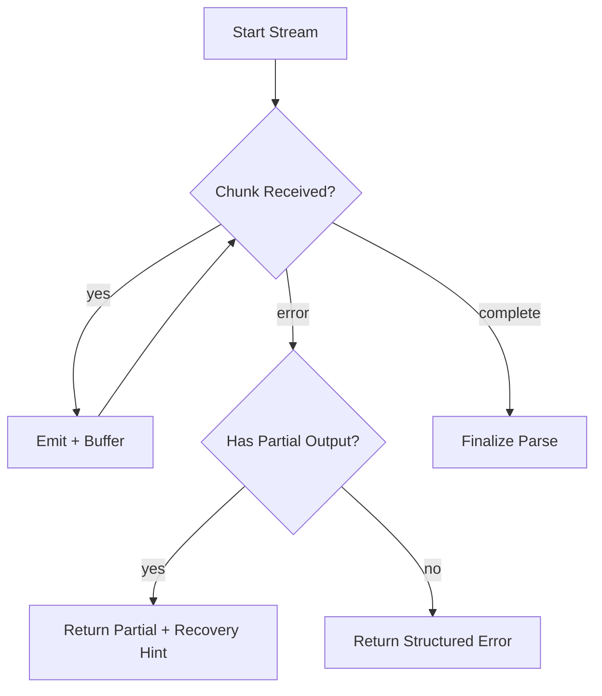

Observability matters here. Input and output token metrics, truncation flags, and stream-interruption markers are not optional if you want to tune cost and reliability.

#### Deep Dive: Streaming Is a Contract Between UX and Parsers
Streaming code generation has two consumers: humans and machines.

Humans need immediate progress signals. Machines need stable accumulation for structural parsing. If either side is neglected, quality drops. A common failure mode is implementing UI streaming without parser-aware buffering. Another is parser-first buffering with no incremental UX updates.

The system gets robust when chunk handling preserves both concerns with explicit lifecycle events: started, chunk, complete, partial-failed.

### Apply This
1. Pattern: Dual-Path Streaming
Problem it solves: Choosing between UX streaming and parser stability.
How to adapt: Emit chunks to UI and append the same chunks to an ordered server buffer.
Pitfall: Do not mutate chunk order with asynchronous fan-out writes.

2. Pattern: Partial Completion Semantics
Problem it solves: All-or-nothing behavior when late-stage streaming fails.
How to adapt: Return partial text plus recovery metadata when completion is interrupted.
Pitfall: Partial output without status flags confuses both users and automation.

3. Pattern: Streaming Telemetry
Problem it solves: Cost and reliability tuning without visibility.
How to adapt: Capture token usage, first-token time, completion time, interruption reason.
Pitfall: Metrics without request correlation IDs are operationally weak.

4. Pattern: Structured Finalization
Problem it solves: Beautiful streaming output that cannot be applied safely.
How to adapt: Make parse finalization an explicit phase after chunk completion.
Pitfall: Parsing mid-stream as if complete leads to malformed artifact extraction.

5. Pattern: Failure-Aware UX
Problem it solves: Silent stalls that look like dead systems.
How to adapt: Surface generation phase and fallback messaging during interruptions.
Pitfall: Avoid generic error banners that hide actionable context.

---

## Chapter 6: Context Selection - The Art of Smart File Inclusion

### Opening
Chapter 5 showed how tokens move. This chapter decides which knowledge enters those tokens in the first place.

Context selection is where many AI coding products quietly fail. Teams blame models for incoherence when the real issue is context noise. Sending too much context dilutes relevance. Sending too little context produces brittle edits.

By the end of this chapter, you will understand context selection as a ranked retrieval pipeline with hard token budgets and intent-aware priority.

### Body
Open Lovable's context strategy can be read as a three-stage narrowing process:

1. Intent anchors candidate files.
2. Dependency relationships expand local neighborhoods.
3. Token budget trims to fit the generation envelope.


The manifest is the enabling structure. It tracks imports, exports, component hints, route relationships, and style resources. This creates a practical dependency graph without full compiler infrastructure.

```ts
// Pseudocode - context selection pipeline
function selectContext(intent, manifest, budget) {
  anchors = resolveTargets(intent, manifest)
  neighbors = expandByImportsAndUsers(anchors, manifest)
  ranked = rankByRelevance([anchors, neighbors], intent)

  chosen = []
  tokens = 0
  for (file in ranked) {
    fileTokens = estimateTokens(file.content)
    if (tokens + fileTokens > budget) continue
    chosen.push(file)
    tokens += fileTokens
  }

  return chosen
}
```

A useful ranking heuristic gives privileged weight to files directly implicated by user intent. Shared utilities should generally lose to local component siblings unless intent indicates foundational refactoring.

The hard part is budget discipline. Token budgets are not suggestions. They are operational constraints. If budget handling is deferred to model truncation, you lose deterministic control over what context survives.

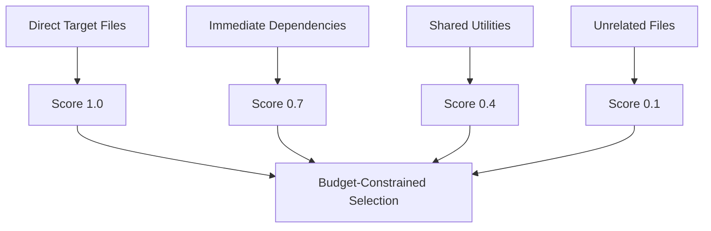

A pragmatic safety policy is to preserve at least one known entry surface and one local style surface when possible. This helps generation avoid structurally correct but visually disconnected output.

#### Deep Dive: Why Regex-Backed Manifests Beat Full AST Early
Full AST pipelines are powerful but expensive to maintain across framework variance, mixed dialects, and generated code artifacts. For this domain, lightweight parsing often captures enough structure to drive high-quality context decisions.

The strategic insight: optimize for selection quality per unit complexity, not theoretical completeness. You can graduate to AST enrichment later if retrieval quality plateaus.

### Apply This
1. Pattern: Intent-First Retrieval
Problem it solves: Context sets disconnected from user request.
How to adapt: Resolve initial candidates from intent taxonomy before any graph expansion.
Pitfall: Broad intent categories can over-expand context and waste budget.

2. Pattern: Dependency Neighborhoods
Problem it solves: Single-file edits that miss coupled components.
How to adapt: Include direct imports and reverse-import consumers around anchors.
Pitfall: Unbounded neighborhood depth causes context explosion.

3. Pattern: Deterministic Budgeting
Problem it solves: Unpredictable truncation by model-side limits.
How to adapt: Estimate tokens per file and enforce hard pre-send limits.
Pitfall: Inaccurate token estimators can still overflow; keep headroom.

4. Pattern: Relevance Scoring Tiers
Problem it solves: Alphabetical or accidental file ordering.
How to adapt: Weight files by semantic relation to intent and execution role.
Pitfall: Score drift happens when heuristic weights are not reviewed against outcomes.

5. Pattern: Manifest as Shared Primitive
Problem it solves: Recomputing project structure for each request.
How to adapt: Build and cache manifest updates incrementally.
Pitfall: Cache invalidation bugs silently degrade context quality.

---

## Chapter 7: Response Parsing - Extracting Files, Packages, and Actions from AI Output

### Opening
Chapter 6 selected the right inputs. Chapter 7 handles the mirror problem: converting model output back into executable structure.

Model output is usually semi-structured at best. Even with strong prompting, output can include duplicate file blocks, incomplete tags, and mixed formatting conventions. Parsing must be tolerant without becoming reckless.

By the end of this chapter, you will understand robust extraction as a layered parser strategy: strict first, lenient second, safety checks always.

### Body
Open Lovable expects structured file sections but supports fallback patterns. The parser attempts high-confidence patterns first and progressively relaxes assumptions.

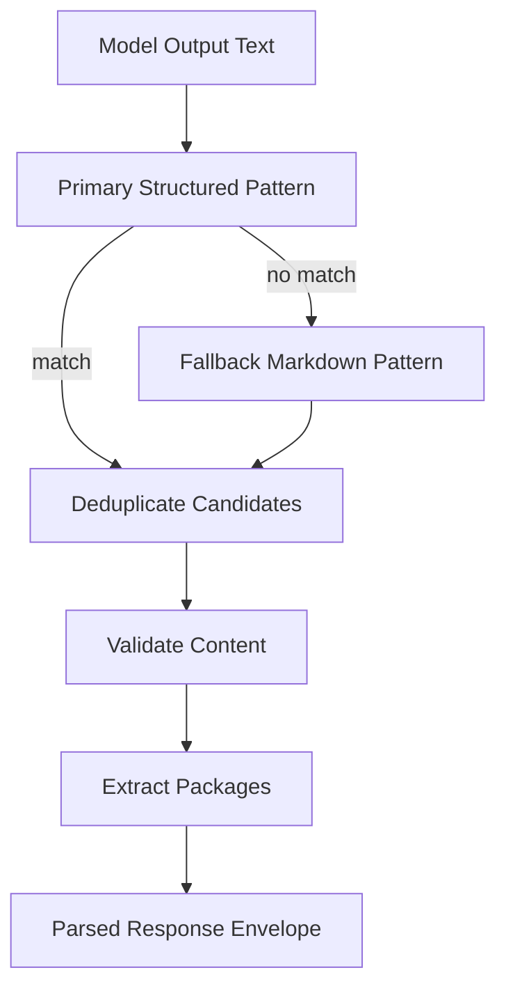

Deduplication policy matters more than it appears. The same file may appear multiple times due to self-correction in streaming completions. Keeping the most complete variant, rather than the first variant, substantially reduces apply-time errors.

```ts
// Pseudocode - layered extraction strategy
function parseResponse(text) {
  candidates = parsePrimaryBlocks(text)
  if (candidates.empty()) candidates = parseFallbackBlocks(text)

  uniqueFiles = dedupeByPath(candidates, preferMostComplete)
  validated = uniqueFiles.filter(contentLooksSane)
  packages = extractImports(validated)

  return { files: validated, packages }
}
```

Package extraction from imports is a practical bridge from generation to runtime readiness. If generated files reference unknown external modules, downstream installation can be initiated without asking the model to separately enumerate dependencies.

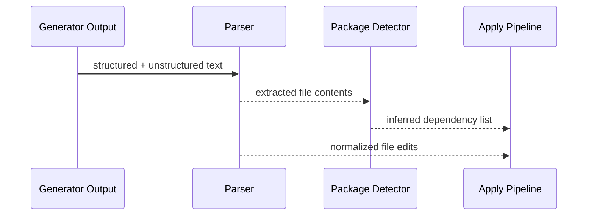

Validation should be lightweight but strict enough to reject obvious corruption. Examples include suspicious placeholders, malformed closures, or aggressively truncated sections.

#### Deep Dive: Lenient Parsing, Strict Application
A common mistake is pairing strict parsing with lenient apply. That causes false negatives early and silent corruption later.

The better posture is inverse:

- Parse leniently to salvage useful structure from imperfect output.
- Apply strictly with sanity checks and rollback capability.

This preserves momentum while protecting runtime integrity.

### Apply This
1. Pattern: Parser Cascade
Problem it solves: Single-format assumptions in multi-provider outputs.
How to adapt: Implement ordered parser passes from strict to permissive.
Pitfall: Too many permissive fallbacks can accept garbage as valid edits.

2. Pattern: Completeness-Aware Deduplication
Problem it solves: Duplicate file blocks with conflicting content.
How to adapt: Pick file variants by structural completeness signals.
Pitfall: Longest-content heuristic alone can select verbose but malformed blocks.

3. Pattern: Dependency Inference from Code
Problem it solves: Separate dependency declarations drifting from actual imports.
How to adapt: Extract package names directly from parsed import statements.
Pitfall: Misclassifying local aliases as external packages inflates install noise.

4. Pattern: Sanity Filters
Problem it solves: Writing obviously broken files into runtime.
How to adapt: Reject or flag artifacts with truncation markers or malformed structure.
Pitfall: Overly strict filters can discard recoverable partial outputs.

5. Pattern: Parse-Apply Separation
Problem it solves: Entangling extraction logic with file mutation logic.
How to adapt: Emit a normalized parse envelope that apply layer consumes independently.
Pitfall: Cross-layer coupling makes debugging parser regressions much harder.

---

## Chapter 8: Structured Prompting - Guiding the LLM to Produce Usable Artifacts

### Opening
Chapter 7 showed how to salvage and normalize imperfect output. Chapter 8 moves upstream to reduce imperfection at the source: prompt design as protocol design.

In production systems, prompts are not creative writing. They are interface definitions with behavioral constraints. The objective is not eloquent output. The objective is output that can be parsed, applied, validated, and iterated.

By the end of this chapter, you will understand how Open Lovable composes prompts as layered contracts and why examples, constraints, and negative rules outperform vague instructions.

### Body
Prompt composition typically has three layers:

- Role and rules: what the model is expected to produce and avoid
- Context package: selected project files, intent metadata, recent conversation cues
- User request: the current task in natural language

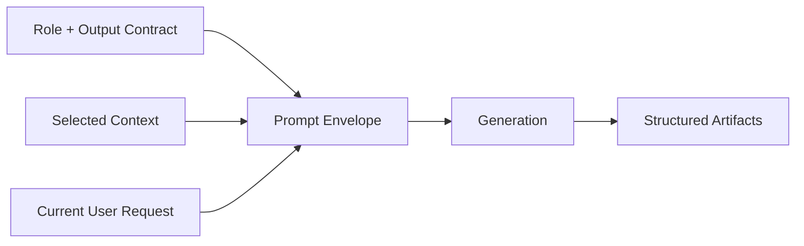

The most effective format instructions are explicit and testable. They define delimiters, required fields, and forbidden behaviors. Ambiguous constraints create expensive parser complexity later.

```ts
// Pseudocode - prompt assembly pipeline
function buildPrompt(intent, contextFiles, taskPrompt) {
  directiveSet = loadGenerationRules({ format: "structured-files", safety: "no destructive rewrites" })
  examples = loadCanonicalExamples(intent.type)
  backgroundBundle = serializeContext(contextFiles)

  return compose([
    directiveSet,
    examples,
    backgroundBundle,
    "Author intent:",
    taskPrompt
  ])
}
```

A useful discipline is pairing positive and negative examples. Positive examples show desired structure. Negative examples show common failure modes to avoid. This duality often improves compliance more than adding more prose.

Prompt size is a budgeted resource. Conversation history inclusion should be selective. Recent turns with direct relevance generally outperform complete history dumps.

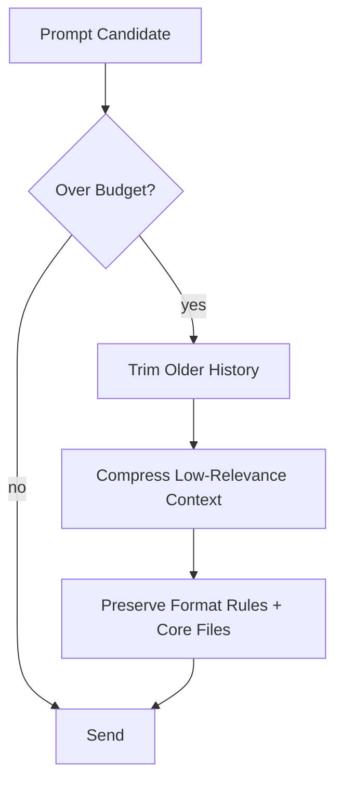

The non-obvious point: format compliance is a quality dimension. If your parser and applier depend on structure, then structure correctness is as important as code correctness.

#### Deep Dive: Why "Explain Your Reasoning" Often Hurts Production Output
Reasoning-heavy prompts can be useful in analysis workflows, but for structured code artifact generation they often inflate output, increase variance, and crowd out format adherence.

Production prompt design should optimize for deterministic artifact generation and minimal post-processing ambiguity. If reflective reasoning is needed, isolate it in a separate analysis call rather than mixing it into artifact emission.

### Apply This
1. Pattern: Prompt as Protocol
Problem it solves: Inconsistent model output across similar requests.
How to adapt: Define explicit output grammar with required delimiters and sections.
Pitfall: Protocols without example payloads are interpreted loosely.

2. Pattern: Positive and Negative Examples
Problem it solves: Repeated hallucinated formatting mistakes.
How to adapt: Include one good example and one anti-pattern example in rule section.
Pitfall: Too many examples can consume context budget and reduce task focus.

3. Pattern: Selective Conversation Memory
Problem it solves: Prompt bloat from unfiltered history inclusion.
How to adapt: Include only recent turns with direct structural relevance.
Pitfall: Aggressive trimming can remove crucial unresolved constraints.

4. Pattern: Constraint Prioritization
Problem it solves: Long rule lists with unclear priority.
How to adapt: Order constraints by severity and apply-layer dependency.
Pitfall: Equal-weight rules create contradictory behavior under pressure.

5. Pattern: Split Thinking from Emission
Problem it solves: Verbose responses that degrade parse reliability.
How to adapt: Use one path for analysis, one path for structured artifact output.
Pitfall: Mixing modes in one response raises parser and compliance complexity.

---

## End of Part 2

Part 2 established the executable core: stream generation, select context deliberately, parse defensively, and prompt as protocol. Part 3 now turns those artifacts into runtime reality through sandbox abstraction, application strategy, and recovery loops.

## Part 3: Application and Validation

[Back to Table of Contents](#table-of-contents)

Epigraph: Generated code is potential energy; runtime validation converts it into useful work.

## Chapter 9: The Sandbox Abstraction - Execution as a Swappable Capability

### Opening
Chapter 8 ended with structured artifacts that can be applied. This chapter answers the next question: where do those artifacts run safely? Open Lovable treats runtime execution as a provider capability, not a fixed environment.

Without this layer, every generation cycle would risk polluting host state, breaking local dependencies, or coupling business logic to one sandbox vendor. The abstraction exists to separate lifecycle semantics from provider mechanics.

By the end of this chapter, you should understand why the provider interface is the architectural fulcrum for experimentation speed.

### Body
The core contract is intentionally narrow: create environment, read/write files, run commands, install packages, restart runtime, terminate. This prevents provider-specific features from leaking into higher layers.

```text
# Pseudocode — illustrative capability checklist (not API reference)
runtimeProvider must support:
- start ephemeral environment
- execute shell command and return normalized result
- write/read project files
- install dependencies
- restart dev process when needed
- terminate and release resources
```

The factory selects provider by configuration and environment readiness. This keeps decision-making near startup, not scattered through request handlers.

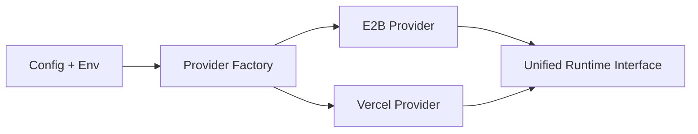

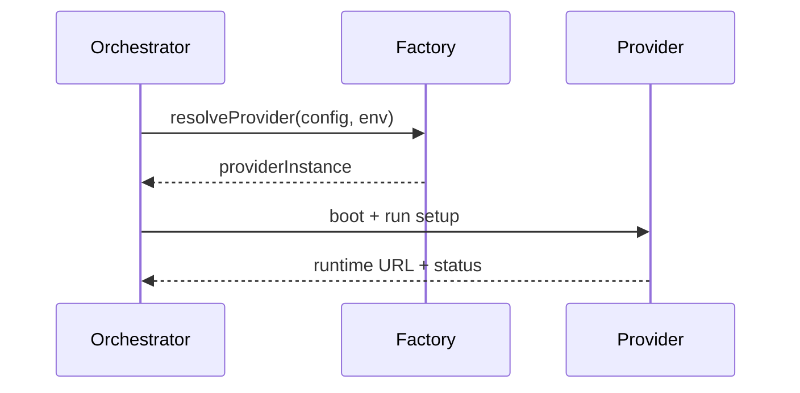

A subtle win is operational fallback. If one provider has degraded latency or quota exhaustion, the system can switch strategy with minimal upper-layer changes.

#### Deep Dive: Interface Width as Risk Control
Teams often design rich provider APIs early, then discover they cannot implement parity across vendors. Open Lovable avoids this by designing the minimum useful interface and letting unsupported operations fail explicitly.

Narrow interfaces reduce migration cost, simplify testing, and prevent hidden lock-in.

### Apply This
1. Pattern: Runtime Capability Boundary
Problem it solves: Environment logic leaking into product flow.
How to adapt: Enforce provider interfaces at compile boundaries.
Pitfall: Overly broad interfaces recreate vendor lock-in.

2. Pattern: Factory-Driven Selection
Problem it solves: Provider conditionals scattered across code.
How to adapt: Resolve provider once from config and credentials.
Pitfall: Silent fallback can hide missing credentials.

3. Pattern: Explicit Lifecycle Methods
Problem it solves: Zombie runtimes and dangling compute.
How to adapt: Require boot, recycle, shutdown in contract.
Pitfall: Optional cleanup paths become incident generators.

4. Pattern: Provider-Neutral Command Results
Problem it solves: Incompatible error payloads.
How to adapt: Normalize stdout, stderr, exit code, success.
Pitfall: Dropping raw diagnostics hurts root-cause analysis.

5. Pattern: Runtime as Disposable Unit
Problem it solves: Hidden state poisoning future requests.
How to adapt: Prefer teardown and recreate over mutation-heavy repair.
Pitfall: Excessive recreation can increase latency and cost.

## Chapter 10: Vite as the Inner Loop - Fast Feedback Under Uncertainty

### Opening
Chapter 9 gave us a sandbox abstraction; now we need a dev server loop that can survive frequent mutation. Open Lovable relies on Vite-like rapid rebuild semantics because AI-generated code fails often and must fail fast.

Perfect first builds are rare in AI-generated workflows. The real objective is a tight loop where failure signals arrive before user trust decays.

By the end of this chapter, you will understand how fast rebuild loops and explicit restart controls keep uncertain code generation usable.

### Body
The runtime loop has three states: writing files, rebuilding, and validating render availability. A monitoring layer inspects logs and exposes actionable errors.

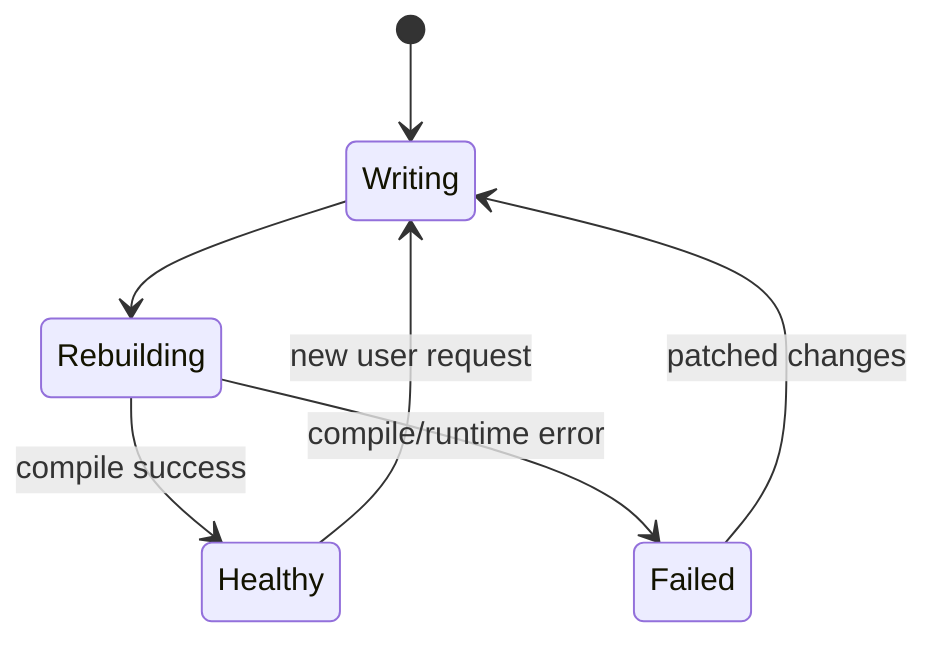

A practical tactic is separating "server is alive" from "build is valid." Port health checks only confirm process existence; users care whether the rendered app is coherent.

```ts
// Pseudocode — simplified health checks
if (portOpen(runtimeUrl) && buildErrors.length === 0) {
  status = "ready"
} else if (portOpen(runtimeUrl)) {
  status = "degraded"
} else {
  status = "down"
}
```

```mermaid
flowchart LR
    A[File Write] --> B[Rebuild Attempt]
    B --> C{Healthy?}
    C -->|yes| D[Serve Preview]
    C -->|no| E[Restart Endpoint]
    E --> F[Rebuild Retry]
```

#### Deep Dive: Why Restart Endpoints Matter
Hot reload is fast until it is not. Stuck module graphs and plugin deadlocks happen. A dedicated restart path is a reliability primitive, not a convenience endpoint.

### Apply This
1. Pattern: Distinguish Liveness and Correctness
Problem it solves: False positives from simple ping checks.
How to adapt: Add compile and runtime signal checks.
Pitfall: Too many probes can amplify load during incidents.

2. Pattern: Rebuild State Machine
Problem it solves: Ad hoc lifecycle transitions.
How to adapt: Model writing, rebuilding, healthy, failed as states.
Pitfall: Missing transitions make diagnostics ambiguous.

3. Pattern: First-Class Restart API
Problem it solves: Manual intervention during stuck dev servers.
How to adapt: Expose restart endpoint with bounded retries.
Pitfall: Unlimited restarts mask underlying structural issues.

4. Pattern: Log Stream as Product Surface
Problem it solves: Opaque failures for users.
How to adapt: Surface normalized error summaries in UI.
Pitfall: Raw logs without filtering overwhelm users.

5. Pattern: Error Cache with Explicit Invalidation
Problem it solves: Stale failures after successful patch.
How to adapt: Clear cache on compile success and on demand.
Pitfall: Aggressive caching can hide fresh regressions.

## Chapter 11: Surgical Code Application - Precision Over Rewrite

### Opening
Chapter 10 established runtime feedback. This chapter focuses on how artifacts are applied: full file rewrites are easy but expensive and brittle. Open Lovable prefers surgical edits when possible.

Users design iteratively. Preserving untouched code reduces surprise and avoids accidental regressions.

By the end of this chapter, you will understand how selective patching lowers blast radius while preserving iteration speed.

### Body
The applier parses model output into edit units and decides between patch-in-place and full replacement. Import scanning doubles as dependency detection.

```ts
// Pseudocode — patch strategy decision
for (edit in parsedEdits) {
  if (edit.hasAnchors && targetFileExists(edit.path)) {
    applyPatch(edit.path, edit.anchor, edit.delta)
  } else {
    writeWholeFile(edit.path, edit.content)
  }
}
```

```mermaid
flowchart TD
    A[Model Output] --> B[Parse Edit Blocks]
    B --> C{Patchable?}
    C -->|yes| D[Apply Delta]
    C -->|no| E[Replace File]
    D --> F[Detect Imports]
    E --> F
    F --> G[Install Missing Packages]
```

A strong design choice is tolerating partial outputs during parsing while enforcing strictness during filesystem writes. This asymmetric strictness keeps the system resilient without corrupting state.

```mermaid
sequenceDiagram
    participant M as Model
    participant P as Parser
    participant W as Writer
    M-->>P: semi-structured response
    P->>W: validated file operations
    W-->>P: success or conflict
```

#### Deep Dive: Package Detection as Side-Channel Intelligence
Imports are not just syntax; they are intent signals. Scanning import paths during apply enables automatic dependency installation and lowers friction for end users.

### Apply This
1. Pattern: Patch-Then-Replace Strategy
Problem it solves: High blast radius from full rewrites.
How to adapt: Prefer anchored patches, fallback to replace.
Pitfall: Fragile anchors can misapply edits silently.

2. Pattern: Parse Lenient, Write Strict
Problem it solves: Dropped edits from minor format drift.
How to adapt: Accept broad input forms, validate before disk writes.
Pitfall: Leniency without strict write guards risks corruption.

3. Pattern: Dependency Detection During Apply
Problem it solves: Missing package errors after generation.
How to adapt: Extract import packages before build validation.
Pitfall: Scoped package parsing mistakes produce bad installs.

4. Pattern: Path Normalization Boundary
Problem it solves: Inconsistent sandbox path conventions.
How to adapt: Normalize paths before every file operation.
Pitfall: Double-normalization can break absolute paths.

5. Pattern: Preserve User-Owned Files
Problem it solves: AI overwriting intentional customizations.
How to adapt: Maintain allowlist/denylist rules for high-risk files.
Pitfall: Overprotection can block necessary architecture changes.

## Chapter 12: Build Validation and Error Recovery - Closing the Loop

### Opening
Chapters 9-11 produced runnable code changes. This chapter completes the loop: classify failures, decide retry posture, and recover with bounded cost.

Without classification, every failure looks equal and retry logic becomes random. The system needs policy, not hope.

By the end of this chapter, you will understand how typed failures drive predictable recovery and clearer user messaging.

### Body
Validation combines compile signals, runtime checks, and missing dependency extraction. Error classes drive retry delays and user messaging.

```mermaid
flowchart TD
    A[Validation Failure] --> B{Error Type}
    B -->|Missing Package| C[Install + Retry]
    B -->|Transient Infra| D[Backoff + Retry]
    B -->|Syntax/Logic| E[Request Regeneration]
    B -->|Fatal Config| F[Escalate to User]
```

```ts
// Pseudocode — retry delay policy
delay = baseDelay * 2 ** attempt
if (errorType == "missing-package") delay = shortDelay
if (attempt > maxAttempts) stopAndExplain()
```

The important trade-off: over-retry creates latency and hides design mistakes; under-retry creates false failure. Good systems encode this trade-off explicitly.

```mermaid
stateDiagram-v2
    [*] --> Failed
    Failed --> Recovering: retry policy allows
    Recovering --> Healthy: validation passes
    Recovering --> Escalated: retry budget exceeded
```

#### Deep Dive: Error Messages as Control Signals
Human-readable messages and machine-actionable codes should coexist. The same event should inform users while steering automation.

### Apply This
1. Pattern: Typed Error Taxonomy
Problem it solves: Retry behavior disconnected from failure cause.
How to adapt: Define categories with explicit policies.
Pitfall: Too many categories degrade operator comprehension.

2. Pattern: Bounded Exponential Backoff
Problem it solves: Retry storms during transient incidents.
How to adapt: Cap attempts and max delay per class.
Pitfall: Global caps may be wrong for expensive operations.

3. Pattern: Dependency-Aware Recovery
Problem it solves: needless regeneration for missing packages.
How to adapt: Install first when imports indicate package gaps.
Pitfall: Blind install attempts can hide spelling mistakes.

4. Pattern: User-Facing Recovery Narratives
Problem it solves: silent retries that feel like hangs.
How to adapt: Surface phase, attempt count, and next action.
Pitfall: Overly technical text increases anxiety.

5. Pattern: Fail Fast on Structural Misconfig
Problem it solves: wasting time on unrecoverable states.
How to adapt: Detect fatal configuration errors early.
Pitfall: Misclassified fatal errors reduce resilience.

---

## End of Part 3

Part 3 converted generation output into executable behavior and reliable recovery. Part 4 now addresses continuity: how the system remembers, adapts, and compounds quality over a conversation.

## Part 4: State and Continuity

[Back to Table of Contents](#table-of-contents)

Epigraph: Intelligence without memory is improvisation; intelligence with memory becomes strategy.

## Chapter 13: Conversation State Architecture - Memory as Product Behavior

### Opening
Part 3 made the loop reliable; Part 4 makes it cumulative. Open Lovable tracks messages, edits, outcomes, and inferred preferences to avoid starting from zero each turn.

The system is conversation-native, not request-native. That distinction explains many design choices that look unusual in traditional CRUD systems.

By the end of this chapter, you will understand how memory structure becomes product behavior, not just implementation detail.

### Body
Conversation state captures roles, timestamps, metadata, edit outcomes, and project evolution milestones. This creates a timeline the system can reason over.

```mermaid
graph TD
    A[User Turn] --> B[Message Log]
    B --> C[Edit Record]
    C --> D[Preference Inference]
    D --> E[Next Prompt Construction]
    E --> F[Improved Turn Quality]
```

```mermaid
stateDiagram-v2
    [*] --> Active
    Active --> Pruned: window exceeded
    Pruned --> Summarized
    Summarized --> Active: next turn appended
```

The architecture prunes history to avoid unbounded growth while retaining high-signal events. It is better to keep concise, structured memory than verbose raw transcripts.

#### Deep Dive: Why Lightweight Global State Can Work
For session-scoped workloads with limited concurrency, process-level state reduces persistence overhead. The trade-off is durability risk; mitigation comes from clear lifecycle assumptions and optional externalization paths.

### Apply This
1. Pattern: Conversation as First-Class Domain Object
Problem it solves: Stateless interactions that repeat mistakes.
How to adapt: Model turns, edits, outcomes as typed entities.
Pitfall: Unbounded state growth inflates prompt cost.

2. Pattern: Metadata-Rich Messages
Problem it solves: Hard-to-reconstruct why changes happened.
How to adapt: Attach edited files, packages, and sandbox ids.
Pitfall: Overcapturing sensitive data creates compliance risk.

3. Pattern: Structured Pruning
Problem it solves: Prompt bloat from naive transcript storage.
How to adapt: Keep recent turns plus key milestones.
Pitfall: Pruning without summaries erases valuable context.

4. Pattern: Evolution Milestones
Problem it solves: Loss of architectural narrative over time.
How to adapt: Log major changes with affected files.
Pitfall: Manual milestone logging often drifts out of date.

5. Pattern: Session Durability Toggle
Problem it solves: One-size-fits-all persistence assumptions.
How to adapt: Support in-memory default with pluggable storage.
Pitfall: Late migration to durable storage is painful.

## Chapter 14: Project Memory - File Manifests and Structural Context

### Opening
Chapter 13 captured conversational continuity. This chapter captures structural continuity: what files exist, how they import each other, and where routes live.

This is the missing middle between raw files and model prompts.

By the end of this chapter, you will understand why a pragmatic manifest is the contract between raw files and reliable targeting.

### Body
A manifest tracks file types, exports, imports, component relationships, and route mapping. This enables targeted context selection and safer edits.

```ts
// Pseudocode — manifest entry shape
manifestItem = {
  path, kind, exports, imports,
  componentTraits, lastTouched
}
```

```mermaid
graph LR
    A[Filesystem Snapshot] --> B[File Parser]
    B --> C[Manifest]
    C --> D[Context Selector]
    C --> E[Intent Analyzer]
    C --> F[Target File Resolver]
```

The parser is heuristic-heavy by design. It extracts enough structure for routing and component targeting without the complexity of full semantic compilation. This manifest forms a compact contract between file state and the context selector: rich enough for decisions, lean enough for speed.

```mermaid
flowchart TD
    A[Changed Files] --> B[Incremental Parse]
    B --> C[Manifest Delta]
    C --> D[Re-rank Target Candidates]
```

#### Deep Dive: Heuristics vs AST-Perfect Analysis
Perfect analysis is expensive and fragile across file variants. Heuristics deliver high leverage quickly and can be incrementally hardened where precision matters most.

### Apply This
1. Pattern: Structural Cache Layer
Problem it solves: Recomputing context from raw files every turn.
How to adapt: Build manifest snapshots with timestamps.
Pitfall: Stale manifests cause incorrect targeting.

2. Pattern: Type-Oriented File Classification
Problem it solves: Undifferentiated treatment of files.
How to adapt: Label page, component, style, utility, config.
Pitfall: Misclassification can skew model context.

3. Pattern: Lightweight Dependency Graph
Problem it solves: Blind edits across unknown import chains.
How to adapt: Track imported-by and imports relations.
Pitfall: Cycles can produce noisy graph traversal.

4. Pattern: Route-Aware Targeting
Problem it solves: Wrong page edits in multi-route apps.
How to adapt: Extract route map and connect to entry components.
Pitfall: Dynamic routes require extra parsing logic.

5. Pattern: Incremental Rebuild of Manifest
Problem it solves: Slow full re-index on every change.
How to adapt: Update only touched files and neighbors.
Pitfall: Partial updates can drift without periodic full checks.

## Chapter 15: Preference Learning - Adaptive Editing Styles

### Opening
With conversational and structural memory in place, the system can adapt to user style. Open Lovable infers whether users prefer precise edits or broad redesigns and adjusts behavior.

Preference learning is not personalization theater; it reduces friction and rework.

By the end of this chapter, you will understand how lightweight preference inference steers strategy without trapping users in a rigid mode.

### Body
Signals come from language patterns and edit outcomes. The system distinguishes targeted verbs from comprehensive redesign language, then biases strategy.

```mermaid
sequenceDiagram
    participant U as User
    participant A as Analyzer
    participant M as Memory
    participant G as Generator
    U->>A: "Update header spacing"
    A->>M: record targeted signal
    M-->>G: prefer minimal context + focused edits
    G-->>U: surgical patch
```

This approach remains interpretable. Teams can inspect why a preference was inferred, unlike opaque latent-profile systems.

```mermaid
flowchart LR
    A[Language Signals] --> B[Weighted Scoring]
    C[Edit Outcomes] --> B
    B --> D[Strategy Bias]
    D --> E[Targeted or Comprehensive Edit Plan]
```

#### Deep Dive: Avoiding Overfitting to Recent Turns
Recent turns are noisy. Preference inference should use decayed weighting, not immediate hard flips, to avoid oscillation.

### Apply This
1. Pattern: Interpretable Preference Signals
Problem it solves: Unexplainable personalization behavior.
How to adapt: Use explicit features from user language and outcomes.
Pitfall: Feature creep makes behavior unpredictable.

2. Pattern: Decayed Weighting
Problem it solves: Overreacting to one atypical request.
How to adapt: Weight recent signals more, but not absolutely.
Pitfall: Wrong decay constants create sluggish adaptation.

3. Pattern: Strategy Bias, Not Hard Lock
Problem it solves: User trapped in inferred mode.
How to adapt: Treat preference as prior, allow override each turn.
Pitfall: Hidden overrides confuse both user and system.

4. Pattern: Outcome-Linked Learning
Problem it solves: Learning from requests without validating success.
How to adapt: Tie preference updates to edit outcomes.
Pitfall: Success metrics that ignore user satisfaction are misleading.

5. Pattern: Human-Readable Preference State
Problem it solves: Impossible debugging of adaptive behavior.
How to adapt: Store preference rationale in concise descriptors.
Pitfall: Verbose rationales bloat state and prompts.

---

## End of Part 4

Part 4 explained how memory compounds quality across turns. Part 5 shifts to the visible surface: preview, error communication, and interaction design that keeps users oriented while the system is uncertain.

## Part 5: UI and Experience

[Back to Table of Contents](#table-of-contents)

Epigraph: Reliability is invisible until it fails; UX decides whether users stay during failure.

## Chapter 16: Real-Time Sandbox Preview - Making Generation Tangible

### Opening
Part 4 gave us continuity; Part 5 makes it visible. Users trust systems that show concrete progress, not systems that merely promise eventual outcomes.

The preview pipeline bridges backend execution and frontend confidence.

By the end of this chapter, you will understand how preview timing and state labeling convert backend uncertainty into user confidence.

### Body
The preview subsystem polls sandbox status, reflects build state, and refreshes output after code application. Timing choices become UX architecture.

```mermaid
flowchart LR
    A[Apply Changes] --> B[Sandbox Rebuild]
    B --> C[Status API]
    C --> D[Preview Component]
    D --> E[User Perception: Progress]
```

A mature choice is delaying refresh slightly after package installs; immediate reload often races with dependency resolution and creates false failure flashes.

```mermaid
sequenceDiagram
    participant UI as Preview UI
    participant API as Status API
    participant RT as Runtime
    UI->>API: poll status
    API->>RT: check build + server
    RT-->>API: healthy/degraded/down
    API-->>UI: labeled state
```

#### Deep Dive: Perception-Optimized Refresh Windows
Short intentional delays often improve perceived stability more than ultra-aggressive polling.

### Apply This
1. Pattern: Preview as System Contract
Problem it solves: abstract backend work with no user evidence.
How to adapt: Always pair generation with observable runtime state.
Pitfall: Preview without state labels causes misinterpretation.

2. Pattern: State-Labeled UI
Problem it solves: indistinguishable loading vs failure.
How to adapt: Surface creating, rebuilding, ready, failed states.
Pitfall: Too many states overwhelm non-technical users.

3. Pattern: Adaptive Refresh Delay
Problem it solves: race conditions after installs and restarts.
How to adapt: longer delay for package install paths.
Pitfall: Fixed high delays can feel sluggish.

4. Pattern: Out-of-Band Health Checks
Problem it solves: stale iframes masking backend issues.
How to adapt: poll health endpoint independent of iframe load.
Pitfall: Over-polling increases infra noise.

5. Pattern: Preview Fallback Messaging
Problem it solves: blank screens during transient failure.
How to adapt: show actionable diagnostics and retry affordance.
Pitfall: Generic fallback text erodes trust.

## Chapter 17: Error Communication - From Stack Traces to Decisions

### Opening
Chapter 16 made progress visible; this chapter makes failure useful. Error messages are part of the control plane for both users and recovery automation.

Good systems translate technical faults into next actions.

By the end of this chapter, you will understand how to make one error event serve both human decision-making and automated recovery policy.

### Body
Open Lovable surfaces concise diagnostics while retaining richer logs for debugging. Classification maps errors to user guidance and automated follow-up.

```mermaid
flowchart TD
    A[Raw Error] --> B[Classifier]
    B --> C[User Message]
    B --> D[Automation Policy]
    D --> E[Retry/Reinstall/Regenerate]
```

The communication strategy avoids false certainty. Messages should acknowledge what is known, what is being attempted, and what the user can do next.

```mermaid
flowchart LR
    A[Error Class] --> B[User Summary]
    A --> C[Retry Policy]
    C --> D[System Action]
    D --> E[Updated User Message]
```

#### Deep Dive: The Cost of Over-Explaining
Long error dumps shift cognitive load to users. Most users need decision support, not forensic detail. Keep detail collapsible.

### Apply This
1. Pattern: Dual-Layer Diagnostics
Problem it solves: mismatch between user needs and developer needs.
How to adapt: concise message + expandable technical detail.
Pitfall: hiding all detail blocks advanced users.

2. Pattern: Action-Oriented Error Copy
Problem it solves: users stuck after failure.
How to adapt: include next system action and manual options.
Pitfall: vague verbs like "try again" without context.

3. Pattern: Error-to-Policy Mapping
Problem it solves: inconsistent recovery behavior.
How to adapt: bind each class to explicit action path.
Pitfall: policy drift when classes evolve.

4. Pattern: Confidence-Aware Messaging
Problem it solves: overconfident statements during uncertain diagnosis.
How to adapt: encode confidence in wording.
Pitfall: too much hedging sounds incompetent.

5. Pattern: Collapsible Technical Context
Problem it solves: UI noise from stack traces.
How to adapt: summary first, details on demand.
Pitfall: inaccessible raw logs hamper debugging.

## Chapter 18: Motion and Micro-Feedback - UX for Waiting States

### Opening
Chapter 17 translated failures into decisions. This chapter handles the space before failure or success is known: waiting.

Error communication handles failures; motion handles waiting. In AI systems, waiting is unavoidable, so interaction design must keep users informed and calm.

By the end of this chapter, you will understand how phase-aware motion patterns reduce abandonment during uncertain latency windows.

### Body
Open Lovable uses progress indicators, subtle transitions, and staged reveals to align interface rhythm with backend phases.

```mermaid
gantt
    title Perceived Progress Timeline
    dateFormat  X
    axisFormat %s
    section Backend
    Analyze intent      :a1, 0, 2
    Generate code       :a2, 2, 4
    Apply + build       :a3, 6, 4
    section UI
    Show intent phase   :b1, 0, 2
    Stream output hints :b2, 2, 4
    Preview status      :b3, 6, 4
```

Micro-feedback can reduce abandonment by proving the system is still making progress and by naming the current phase in plain language.

```mermaid
stateDiagram-v2
    [*] --> Idle
    Idle --> Working: request submitted
    Working --> Partial: streaming update
    Working --> Failed: error state
    Partial --> Ready: preview loaded
    Failed --> Working: retry
```

#### Deep Dive: Animations as Trust Instruments
In uncertainty-heavy workflows, timing consistency matters more than visual complexity. Predictable transitions reduce perceived instability.

### Apply This
1. Pattern: Phase-Aligned Feedback
Problem it solves: static loaders that communicate nothing.
How to adapt: map backend stages to UI labels and transitions.
Pitfall: fake stage progression breaks trust.

2. Pattern: Low-Amplitude Motion
Problem it solves: distracting animations during cognitive tasks.
How to adapt: subtle opacity/position shifts over dramatic effects.
Pitfall: zero motion makes UI feel frozen.

3. Pattern: Waiting-Time Narration
Problem it solves: perceived hangs during long operations.
How to adapt: describe current phase and expected next phase.
Pitfall: inaccurate ETA messaging backfires quickly.

4. Pattern: Failure Transition Clarity
Problem it solves: abrupt jumps from loading to error.
How to adapt: animate state change and preserve context.
Pitfall: decorative transitions can hide urgent failures.

5. Pattern: Accessibility-First Motion
Problem it solves: reduced usability for motion-sensitive users.
How to adapt: honor reduced-motion preferences.
Pitfall: ignoring accessibility settings creates exclusion.

---

## End of Part 5

Part 5 covered trust at the interface boundary. Part 6 turns back inward to robustness under real-world pressure: package chaos, timeouts, and provider degradation.

## Part 6: Robustness and Operations

[Back to Table of Contents](#table-of-contents)

Epigraph: Robust systems are not those that never fail, but those that fail in ways users can recover from.

## Chapter 19: Package Installation Strategy - Dependency Chaos Management

### Opening
Chapter 18 addressed motion during uncertainty. This chapter addresses operational uncertainty: packages that do not exist yet, retries that multiply, and builds that fail for fixable reasons.

AI-generated code naturally references packages that may not exist in runtime. This chapter explains how Open Lovable reduces dependency friction without forcing users into manual package management.

By the end of this chapter, you will understand two-pass dependency resolution as a core operational pattern for reducing retry cycles.

Dependency handling is a workflow issue, not just a tooling detail.

### Body
The strategy combines pre-build import scanning with post-failure extraction. This two-pass approach catches obvious misses early and resolves edge cases after build diagnostics.

```mermaid
flowchart TD
    A[Applied Files] --> B[Scan Imports]
    B --> C[Install Candidate Packages]
    C --> D[Build]
    D --> E{Missing Module?}
    E -->|yes| F[Extract + Install + Retry]
    E -->|no| G[Ready]
```

Install operations are batched to reduce startup churn but bounded to avoid runaway dependency storms.

```mermaid
sequenceDiagram
    participant A as Applier
    participant I as Import Scanner
    participant P as Package Manager
    participant B as Build Validator
    A->>I: gather import candidates
    I->>P: install deduped packages
    P-->>B: rebuild trigger
    B-->>A: success or missing-module details
```

#### Deep Dive: False Positives in Import-Based Detection
Not every import path is an installable package. Scoped internal aliases and virtual modules can trigger false installs if normalization is weak.

### Apply This
1. Pattern: Two-Pass Dependency Resolution
Problem it solves: missed packages in either parser or build step.
How to adapt: pre-scan imports, then parse build errors.
Pitfall: duplicated installs without dedupe logic.

2. Pattern: Install Batching with Bounds
Problem it solves: slow sequential installs.
How to adapt: batch installs per cycle with max package cap.
Pitfall: large batches complicate rollback on failure.

3. Pattern: Alias-Aware Import Parsing
Problem it solves: installing internal alias paths.
How to adapt: filter relative and configured alias prefixes.
Pitfall: missing alias config causes noisy retries.

4. Pattern: Dependency Retry Budget
Problem it solves: infinite install-rebuild loops.
How to adapt: limit dependency repair attempts per turn.
Pitfall: too-low budgets increase manual intervention.

5. Pattern: User-Visible Dependency Actions
Problem it solves: unexplained delays during installs.
How to adapt: surface installing packages phase explicitly.
Pitfall: exposing raw package names may confuse novices.

## Chapter 20: Timeout and Deadline Management - Latency as a Resource

### Opening
Chapter 19 handled dependency volatility. This chapter handles time volatility: web scraping delays, provider lag, runtime boot times, and long builds.

Latency is not just a metric; it is a budget you allocate across steps.

By the end of this chapter, you will understand how deadline propagation keeps multi-step workflows honest under real latency pressure.

### Body
Open Lovable configures per-layer timeouts (scraping, generation, sandbox startup, rebuild) rather than one monolithic request timeout.

```ts
// Pseudocode — deadline orchestration
deadline = now + requestBudget
phase("scrape", min(phaseBudget.scrape, deadline-now))
phase("generate", min(phaseBudget.generate, deadline-now))
phase("apply", min(phaseBudget.apply, deadline-now))
if (deadlineExceeded()) return partialResultWithState()
```

```mermaid
flowchart TD
    A[Request Budget] --> B[Scrape Budget]
    A --> C[Generate Budget]
    A --> D[Apply Budget]
    B --> E[Remaining Deadline]
    C --> E
    D --> E
```

This enables partial progress reporting when full completion is impossible inside budget. It also complements the adaptive refresh delay pattern from Chapter 18: the UI may wait slightly longer for perception stability, but orchestration still enforces hard request deadlines.

#### Deep Dive: Timeouts as Product Decisions
A 30-second timeout is not neutral. It implies a UX promise, retry policy, and cost profile. Treat timeout values as versioned product configuration.

### Apply This
1. Pattern: Phase-Specific Timeout Budgets
Problem it solves: one timeout value that fits none of the phases.
How to adapt: allocate explicit budgets per subsystem.
Pitfall: static budgets ignore traffic and provider drift.

2. Pattern: Deadline Propagation
Problem it solves: subcalls ignoring top-level request constraints.
How to adapt: pass remaining budget into each downstream call.
Pitfall: forgetting propagation causes timeout cascades.

3. Pattern: Partial Result Semantics
Problem it solves: all-or-nothing user outcomes.
How to adapt: return phase state and resumable context.
Pitfall: partial responses without continuation path frustrate users.

4. Pattern: Timeout Telemetry by Phase
Problem it solves: inability to tune bottlenecks.
How to adapt: record timeout frequency per stage.
Pitfall: aggregated metrics hide worst-case tails.

5. Pattern: Config-Backed Deadline Policy
Problem it solves: hardcoded timeout drift across files.
How to adapt: centralize timeout values in application config.
Pitfall: config sprawl makes ownership unclear.

## Chapter 21: Fallback Patterns - Designing for Provider Failure

### Opening
Chapter 20 constrained time; this chapter constrains failure impact. Even with budgets and retries, providers fail.

Chapter 21 shows how Open Lovable degrades gracefully when AI, scraping, or sandbox vendors are unavailable.

By the end of this chapter, you will understand how to design explicit fallback tiers without hiding operational truth from users.

Fallback is not a backup path; it is a core path activated under stress.

### Body
Fallback layers include alternative model providers, mock scrape data in development, and explicit user messaging when automation cannot proceed.

```mermaid
flowchart TD
    A[Primary Provider Call] --> B{Success?}
    B -->|yes| C[Continue]
    B -->|no| D{Fallback Available?}
    D -->|yes| E[Secondary Path]
    D -->|no| F[Explain + Preserve Context]
```

A key decision is preserving conversation and project context across failures so users can resume instead of restart.

```mermaid
flowchart LR
    A[Failure Class] --> B{Fallback Tier}
    B -->|Tier 1| C[Alternate Provider]
    B -->|Tier 2| D[Synthetic Dev Response]
    B -->|Tier 3| E[User Escalation + Context Save]
```

#### Deep Dive: Graceful Degradation vs Silent Degradation
Silent fallback can mask systemic outages and create inconsistent behavior. Good fallback is explicit to operators and legible to users.

### Apply This
1. Pattern: Tiered Fallback Matrix
Problem it solves: ad hoc failure responses.
How to adapt: define primary, secondary, and terminal paths per subsystem.
Pitfall: untested fallback paths rot quickly.

2. Pattern: Context Preservation on Failure
Problem it solves: users losing work after provider outage.
How to adapt: persist conversation and edit intent before risky calls.
Pitfall: partial saves without integrity checks cause corruption.

3. Pattern: Development-Mode Synthetic Responses
Problem it solves: blocked local development without external keys.
How to adapt: provide obvious mock responses with clear labels.
Pitfall: mock behavior leaking into production runtime.

4. Pattern: Operator-Visible Degradation Flags
Problem it solves: hidden fallback dependence in production.
How to adapt: emit metrics/events when secondary paths activate.
Pitfall: alert fatigue if thresholds are poorly tuned.

5. Pattern: User-Transparent Failure Modes
Problem it solves: unexplained quality variance across requests.
How to adapt: communicate when system used backup path.
Pitfall: overly technical disclosure can cause confusion.

---

## End of Part 6

Part 6 covered operational resilience. Part 7 closes the book by extracting reusable architecture patterns and a decision framework for building similar systems.

## Part 7: Synthesis and Transfer

[Back to Table of Contents](#table-of-contents)

Epigraph: A strong architecture teaches beyond itself.

## Chapter 22: Transferable Patterns - What to Steal, What to Avoid

### Opening
Chapter 21 focused on resilience under stress. This chapter zooms out to what survives context shift: reusable architecture patterns.

Previous chapters described Open Lovable in detail. This chapter abstracts the design into portable patterns you can apply to adjacent systems: AI copilots, workflow automators, and generation-driven developer tools.

By the end of this chapter, you will understand which coordination patterns transfer cleanly and which are tightly coupled to this product context.

The point is not to replicate this exact stack. It is to adapt its coordination patterns to your own constraints.

### Body
The system’s biggest architectural bet is the coordination layer: explicit intent analysis, selective context, structured generation, controlled execution, and stateful feedback.

```mermaid
graph TD
    A[Intent Model] --> B[Context Engine]
    B --> C[Generation Protocol]
    C --> D[Execution Sandbox]
    D --> E[Validation + Recovery]
    E --> F[Conversation Memory]
    F --> A
```

The anti-patterns are equally important: monolithic prompts, opaque retries, provider coupling, and stateless loops that relearn the same lesson every turn.

```mermaid
flowchart TD
    A[Pattern Candidate] --> B{Transferable?}
    B -->|yes| C[Generalize Inputs + Outputs]
    B -->|no| D[Keep Product-Specific]
    C --> E[Adopt with Constraints]
    D --> F[Document as Local Optimization]
```

#### Deep Dive: The Coordination Layer as Product Differentiator
Model quality can converge across competitors. Coordination quality is harder to copy because it is encoded in workflow, interfaces, and failure handling.

### Apply This
1. Pattern: Intent Before Generation
Problem it solves: model guesswork about user scope.
How to adapt: classify request type and targets before LLM call.
Pitfall: overfitted intent classes become brittle.

2. Pattern: Selective Context Assembly
Problem it solves: expensive and noisy full-project prompts.
How to adapt: feed only target and dependency neighborhood.
Pitfall: under-selection omits required constraints.

3. Pattern: Protocolized Model Output
Problem it solves: unreliable parsing of free-form text.
How to adapt: enforce section delimiters and artifact schema.
Pitfall: rigid protocols break across model upgrades.

4. Pattern: Disposable Execution Environments
Problem it solves: state contamination and security risk.
How to adapt: run generated code in isolated ephemeral runtime.
Pitfall: poor teardown discipline inflates cost.

5. Pattern: Memory-Driven Iteration
Problem it solves: repetitive errors across turns.
How to adapt: capture outcomes and feed compact history forward.
Pitfall: memory without pruning becomes self-sabotage.

## Chapter 23: Building Your Own - A Decision Framework

### Opening
Chapter 22 extracted transferable patterns. This final chapter turns those patterns into implementation decisions.

This final chapter translates architecture into decisions. Not every team needs every subsystem. The value is in choosing the right depth for your constraints.

By the end of this chapter, you will have a practical sequencing framework for building a system with comparable coordination quality.

If Chapter 22 gave you patterns, this chapter gives you an execution plan.

### Body
Start by deciding your risk posture across five axes: execution isolation, model plurality, memory depth, recovery automation, and UX transparency.

```mermaid
flowchart TD
    A[Need AI Code Workflow?] --> B{Single or Multi Provider}
    B --> C[Output Protocol Design]
    C --> D{Need Safe Execution?}
    D -->|yes| E[Sandbox Layer]
    D -->|no| F[Dry-run Validation]
    E --> G[State + Recovery Strategy]
    F --> G
    G --> H[UX Feedback Design]
```

Then phase delivery intentionally:
1. Ship intent + context + structured generation.
2. Add sandbox and validation.
3. Add memory and preference adaptation.
4. Add multi-provider and operational fallback.

The sequence matters because it aligns complexity with demonstrated need.

```mermaid
graph LR
    A[Phase 1: Intent + Context] --> B[Phase 2: Execution Sandbox]
    B --> C[Phase 3: Memory + Adaptation]
    C --> D[Phase 4: Multi-Provider + Fallback]
```

#### Deep Dive: Build vs Buy by Subsystem
Buying an LLM gateway might be wise while building your own conversation memory and execution policy. Architecture quality comes from selective ownership, not maximal ownership.

### Apply This
1. Pattern: Constraint-First Roadmapping
Problem it solves: overbuilding before product-market evidence.
How to adapt: prioritize subsystems by risk and user pain.
Pitfall: skipping foundations creates expensive rewrites.

2. Pattern: Phased Capability Accretion
Problem it solves: launching too many moving parts at once.
How to adapt: add one reliability layer per milestone.
Pitfall: phase boundaries without metrics become arbitrary.

3. Pattern: Explicit Ownership Matrix
Problem it solves: confusion between built and outsourced capabilities.
How to adapt: map each subsystem to owner and SLA target.
Pitfall: unclear ownership during incidents slows recovery.

4. Pattern: Architecture as Learning System
Problem it solves: static workflows in changing model ecosystems.
How to adapt: instrument loops and refine policy from outcomes.
Pitfall: collecting telemetry without decision loops adds noise.

5. Pattern: Exit Criteria for Complexity
Problem it solves: endless platform expansion.
How to adapt: define what "good enough" means per stage.
Pitfall: no exit criteria means perpetual partial rewrites.

---

## Epilogue: The Architectural Bet Revisited

[Back to Table of Contents](#table-of-contents)

Open Lovable’s deepest insight is that AI-native products are coordination systems first and generation systems second. The model call is only one step. Durable value comes from the layers around it: intent modeling, context shaping, executable isolation, structured recovery, and cumulative memory.

That is why this system is worth studying. The architecture turns uncertain model behavior into predictable product behavior.

If you carry one lesson into your own stack, carry this: optimize the handoffs. Most failures in AI applications are not failures of intelligence. They are failures of coordination.
